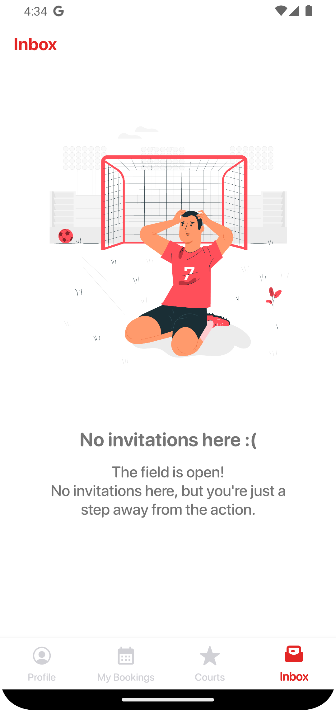

# fpCourts - Sports Field Booking App for Android

## 📝 Project Overview

**Course:** Mobile Application Development @ Politecnico di Torino
**Team:** Federico Boscolo, Antonio De Cinque, Simone Paniati, Flavio Patti

Developed as part of the Mobile Application Development course at Politecnico di Torino, fpCourts is a user-centric sports field booking application designed for Android devices. The idea behind this application to facilitate easy and efficient booking of sports facilities.

## 🌟 Key Features

- **Intuitive Interface:** Employing Kotlin and XML, we have developed a front-end that is not only responsive but also intuitive, ensuring that users can navigate the app with ease.
- **Server-less Architecture:** Utilizes Firestore cloud DB and Firebase for data management and efficient push notification handling, ensuring that the app remains responsive and up-to-date with real-time updates.

### Introduction Screenshots Overview

This screen is designed to introduce users to the app with a brief overview of its capabilities. The design focuses on simplicity and ease of navigation to assist users in starting their booking journey. These screens emphasize the app's community aspect, allowing users to connect with other players. It showcases the capability to manage invitations, review systems, and user interactions within the app, demonstrating advanced user interface elements and data management techniques.

  
&nbsp; &nbsp; &nbsp; &nbsp;
  
&nbsp; &nbsp; &nbsp; &nbsp;
  

### 📅 My Bookings Section Overview

The "My Bookings" section of the **fpCourts** app provides a comprehensive and interactive calendar interface that allows users to manage their bookings effectively. Below is a detailed examination of the user interface design from the screenshots provided:

  
&nbsp; &nbsp; &nbsp; &nbsp;
  

#### 🖥️ UI Features:

1. **Calendar Navigation** 🗓️
   - The top navigation bar includes a compact monthly calendar view, showing the current month and year. Users can navigate between months using the arrows on either side of the month indicator.
   - Days with scheduled events are marked with dots under the date, providing a quick visual cue of active bookings.

2. **View Toggle** 🔄
   - A toggle switch allows users to switch between "Month view" and "Week view," enabling them to choose their preferred calendar display granularity.

3. **Booking Entries** 📝
   - Each booking entry is displayed on the corresponding date, featuring the time of the event, the venue name, and a brief address.
   - An icon next to each venue name indicates the type of sport or activity, helping users quickly identify their bookings by category.

4. **Interactive Elements** 🖱️
   - Each booking card includes an information button and a direction arrow, offering quick access to more detailed information about the booking and navigation options.
   - The "Add booking" button is prominently displayed on each date with a booking, making it easy to add new entries directly from the main interface.

5. **Participants Display** 👥
   - Below the booking details, small icons represent the participants involved in each booking, offering a visual summary of who will attend. Tapping these icons can expand to show more detailed participant information.

6. **Retractable Calendar** ⬆️⬇️
   - The calendar can be expanded or retracted to show or hide the weekly view, allowing users to focus on specific days or get a broader overview of the month.
  

### 🏟️ Available Courts and Reviews Interface

Below are screenshots of the available courts and the review system:

  
&nbsp; &nbsp; &nbsp; &nbsp;
  

#### 📲 Available Courts Interface:
- **Filter by Sport**: Users can easily filter courts by sport type using a drop-down menu.
- **Court Listings**: Each listing displays an image, sport icon, address, and star rating.
- **Interactive Details**: Information buttons provide access to further details and booking options.

#### ⭐ Court Reviews Interface:
- **Review Details**: Users can read and edit reviews, with each entry showing the reviewer's name, profile picture, rating, and review date.
- **Review Management**: An "Edit review" button allows users to update their reviews.

### 📩 Inbox Interface Overview

The app includes an "Inbox" section designed to manage invitations to sports events. Below are screenshots showing how users can interact with invitations, whether accepting them or viewing an empty inbox:

  
&nbsp; &nbsp; &nbsp; &nbsp;
  

#### Features of the Inbox Interface:

1. **Invitation Management**:
   - Users receive clear, actionable notifications for new event invitations.
   - Each invitation card displays the date, time, venue name, and sport type, accompanied by an event organizer icon and contact information.
   - Users can directly accept or reject invitations with prominent red and green buttons.

2. **No Invitations View**:
   - When there are no active invitations, the app displays a friendly and engaging graphic with a message encouraging users to get involved in activities.

